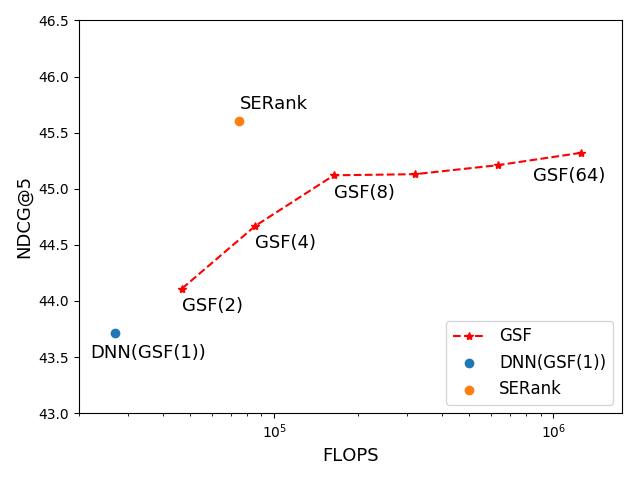
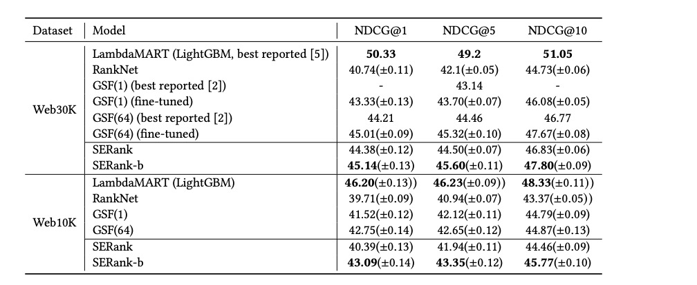

# SERank
An efficient and effective learning to rank algorithm by mining information across ranking candidates.
This repository contains the tensorflow implementation of SERank model. 

Compared with GSF(Groupwise Scoring Function), our method obtains comparable ranking performance gain, while only requiring little computation overhead. 

The SERank model has been suceessfully deployed in [zhihu Search ranking](https://www.zhihu.com/), which is one of the largest Community Question Answering platform in China.





## Dependencies
- [tensorflow-ranking](https://github.com/tensorflow/ranking) >= 2.2.0
- [tensorflow](https://github.com/tensorflow/tensorflow) >= 2.0

## Dataset
The demo dataset in this repo is randomly sampled from MSLR web30k dataset.
You may download the whole web30K dataset from [Microsoft Learning to Rank Datasets
 Page](https://www.microsoft.com/en-us/research/project/mslr/) and place `train.txt`, `vali.txt`, `test.txt` in the data folder.
 
## How to Train
`bash run_train.sh`

## Citation
SERank: Optimize Sequencewise Learning to Rank Using Squeeze-and-Excitation Network. [[arkiv](https://arxiv.org/abs/2006.04084)]

```
@article{wang2020serank,
  title={SERank: Optimize Sequencewise Learning to Rank Using Squeeze-and-Excitation Network},
  author={Wang, RuiXing and Fang, Kuan and Zhou, RiKang and Shen, Zhan and Fan, LiWen},
  journal={arXiv preprint arXiv:2006.04084},
  year={2020}
}
```
